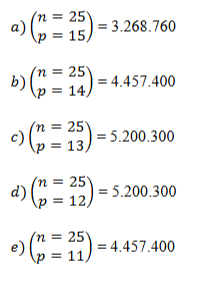

# 1. Introdução — o problema e hipótese de força bruta

> problema: Dado 25 números inteiros de 1 a 25 e as seguintes combinações:

~~~text
Gerar todas as combinações de números para Lotofácil (PROGRAMA 1), de modo que:
    (a) sejam obtidas 3.268.760 sequências de 15 números distintos (S15);
    (b) sejam obtidas 4.457.400 sequências de 14 números distintos (S14);
    (c) sejam obtidas 5.200.300 sequências de 13 números distintos (S13);
    (d) sejam obtidas 5.200.300 sequências de 12 números distintos (S12);
    (e) sejam obtidas 4.457.400 sequências de 11 números distintos (S11).
~~~

* Geração de todas as combinações de 15 números dentre 25 — são 3.268.760 sequências (S15).

* De todas as combinações de 14 números (S14), 13, 12, 11 — conforme os números indicados.

* Para cada cenário (S14, S13, S12, S11), deve encontrar o menor subconjunto de combinações de 15 números (SB15_k) que cubra todos os subconjuntos menores.

## 1.1.  Do brute-force ao bitwise e filtragem

* Força bruta (ou exhaustive search) é uma técnica que tenta todas as possibilidades até encontrar a solução. Isso geralmente envolve loops aninhados ou recursão para gerar candidatos e verificar a condição de sucesso;

* É eficaz em espaços de busca pequenos, mas pode se tornar inviável quando o número de combinações cresce muito.

## 1.2. Quando usar força bruta

* Serve como uma garantia: encontra a solução correta, se ela existir, sem necessidade de heurísticas complexas;

* Boa para benchmark ou fase inicial de entendimento de um problema.

# Vantagens e Desvantagens

## ✅ Vantagens

* Garante a solução (exata), sem omissões;

* Útil como referência para comparar com algoritmos otimizados.

## Desvantagens

* Ineficiente: o número de candidatos cresce muito rápido — geralmente de forma exponencial (2ⁿ, n!) — tornando o tempo de execução impraticável;

* Máquina pode levar dias ou anos para resolver problemas grandes (ex.: 64 bits ≈ 10 anos de execução).

# 3 Conceitos fundamentais 

## 3.1. Complexidade de tempo (Big‑O)

* Representa o crescimento do tempo de execução à medida que a entrada aumenta.

* Para força bruta, geralmente é:

~~~text
    O(2ⁿ) em problemas de subconjuntos;

    O(n!) em problemas de permutação (como TSP);

    até O(n²), O(n³) em abordagens menos extremas 
~~~

* Isso contrasta com algoritmos otimizados que alcançam O(n log n), O(n), etc.

# Exemplo em Python – Força Bruta

~~~python
from typing import List, Tuple

def two_sum_bruteforce(nums: List[int], target: int) -> Tuple[int, int]:
    """
    Encontra índices i, j em nums, com nums[i] + nums[j] == target,
    tentando todas as combinações.
    Complexidade: O(n²) no pior caso.
    """
    n = len(nums)
    for i in range(n):
        for j in range(i + 1, n):
            if nums[i] + nums[j] == target:
                return i, j
    # Se não encontrar, levanta erro ou retorna um valor indicador
    raise ValueError("Nenhum par encontrado")
~~~